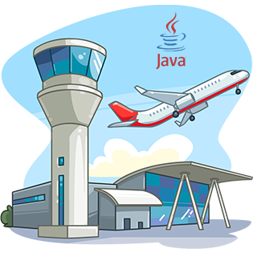
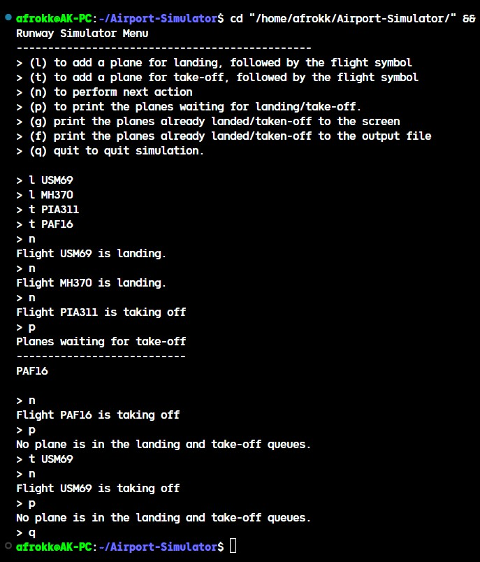

 

  

  <h3 align="center">Airport Simulator</h3>

  

    An ATC Airport Runway Simulation.
     
    <a href="https://github.com/Afrokk/Airport-Simulator" target="_blank"><strong>Check it out.»</strong></a>
     
  

## About The Project

An Airport ATC Simulator built using Java (OOP), using Stacks & Queues. The simulator supports the following:
* Adding/Removing planes to/from the take-off queue.
* Adding/Removing planes to/from the landing queue.
* Queueing the next step for a flight, e.g. take-off or landing.
* Printing all the data in the queues. 
* Outputting all the data in the queues in a file. 

## Built With

Designed and built with vanilla Java. 

[![Java][Java.com]][Java-url]

## How it works
The tester class produces a simple menu printed out to the terminal. The user can interact with the menu as needed. 

  

## Contact

Afrasiyab (Afrokk) Khan -  [afrokk.design](https://afrokk.design/home) - [LinkedIn](https://www.linkedin.com/in/afrasiyab-k/) - [@afrokk_](https://www.instagram.com/afrokk_/) - afrasiyabkhan379@gmail.com

ANOTHER PROJECT: Check out <strong>Vintage Autohaus</strong>: [https://github.com/Afrokk/Vintage-Autohaus](https://github.com/Afrokk/Vintage-Autohaus)

[product-screenshot]: images/logo.png
[Java.com]: https://img.shields.io/badge/java-%23ED8B00.svg?style=for-the-badge&logo=java&logoColor=white
[Java-url]: https://www.java.com/en/
